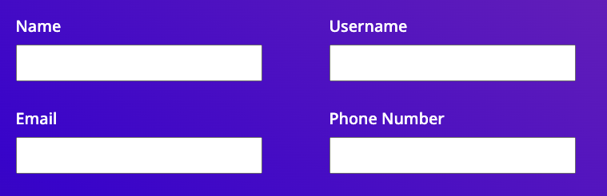
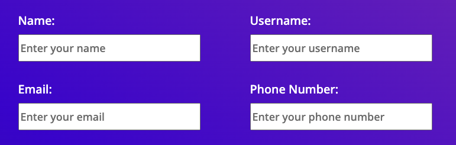

## Code Review Exercise

### Issue #1: Code Formatting

Issue: There are a lot of statements in the given code which are longer in length.

Why this is an issue: This will create an issue in readability and maintanance of the code. It also becomes difficult to follow the line. Hence we need to make sure that there is a consistent style which will improve code maintainance as well as the readability.

Solution: All 3 files : index.html, index.js and styles.css has this issue. Reduced the lengths of big statements by breaking the statement and moving them to next line. I have pasted example of improvements for styles.css and index.js below.

Initial code for styles.css :

```css
  background: linear-gradient(34deg, var(--dark-blue) 6%, var(--blue) 46%, var(--purple) 91%);
```

Updated code for styles.css :

```css
  background: linear-gradient(
    34deg,
    var(--dark-blue) 6%,
    var(--blue) 46%,
    var(--purple) 91%
  );
```
Initial code for index.js :

```javascript
    const popupSection = event.currentTarget.parentElement.parentElement.parentElement;
```

Updated code for index.js :

```javascript
    const popupSection =
      event.currentTarget.parentElement.parentElement.parentElement;
```


### Issue #2: Accessibility

Issue: Missing closing tag for lable tag: In the first p tag element, the closing tag for the lable tag element is missing. It should be lable tag instead of span tag. 

Why it is an issue: It could cause issues like rendering problems, accesssibility concerns, compatibility issues, maintenance challenge.

Solution: Each input tag element is now associated with a label tag element using the for attribute. This improves accessibility by providing a visible label for each input field. Each input tag field should be accompanied by a label tag element that describes the purpose of the field. The for attribute of the label tag should match the id attribute of the corresponding input tag field. This association improves accessibility by providing a clear and programmatically associated label for each input field.Each input field now has a label tag element associated with it, ensuring consistent labeling techniques for accessibility and usability.


### Issue #3: Accessibility

Issue : Placeholder texts were missing for all 4 labels : name, username, email, phone

Why it is an issue: Missing placeholder texts could be an issue from a usability and accessibility standpoint. The placeholder attribute for each input field provides a hint or example of the expected input. Each placeholder text is unique and specific to the purpose of the input field, improving usability. Users might not get better understanding of the expected inputs for fields.

Solution : The placeholder attribute is added to each input field, containing descriptive text that instructs users on what information to enter. For example, "Enter your name" prompts users to input their name, "Enter your email" instructs users to input their email address, and "Enter your phone number" guides users to input their phone number.


### Issue #4: Accessibility


Issue : The use of aria-label on the input tags elements for "Email" and "Phone Number" is redundant because there are visible labels associated with them. It's generally better to rely on visible labels whenever possible and use aria-label only when there's no visible label present.

Why it is an issue: having redundant Aria labels can be issue because of cluttered accessibility tree, ambiguity and confusion. It couls create problem for web developers to create more streamlined and accessible user experience

Solution: The redundant aria-label attributes have been removed from the input tags elements for "Email" and "Phone Number" because there are visible labels associated with them. Using visible labels is preferred over aria-label when possible. Removing redundant aria-label attributes improves accessibility by ensuring that assistive technologies can accurately convey the purpose of each input field without unnecessary duplication of information.


UI and code changes for 2nd, 3rd and 4th issues are as follows : 


Initial Code UI : 
 




Updated code UI: 
 

 


Initial code:

```html
<div class="space-between-distributed-row-container vertically-stacked-sm-screen-container">
          <p class="label-input-group form-element-container">
            <span class="form-label">Name</span>
            <input aria-label="name" class="form-input-box" type="text" id="name" name="name" />
          </p>
          <p class="label-input-group form-element-container">
            <span class="form-label">Username</span>
            <input
              aria-label="username"
              class="form-input-box"
              type="text"
              id="username"
              name="username"
            />
          </p>
        </div>
        <div class="space-between-distributed-row-container vertically-stacked-sm-screen-container">
          <p class="label-input-group form-element-container">
            <span class="form-label">Email</span>
            <input aria-label="email" class="form-input-box" type="email" id="email" name="email" />
          </p>
          <p class="label-input-group form-element-container">
            <span class="form-label">Phone Number</span>
            <input
              aria-label="phone"
              class="form-input-box"
              type="tel"
              id="phone-number"
              name="phone-number"
            />
          </p>
        </div>
```

Updated code:

```html
 <div class="space-between-distributed-row-container vertically-stacked-sm-screen-container">
          <p class="label-input-group form-element-container">
            <label for="name" class="form-label">Name:</label>
            <input type="text" id="name" name="name" class="form-input-box" placeholder="Enter your name" />
          </p>
          <p class="label-input-group form-element-container">
            <label for="username" class="form-label">Username:</label>
            <input
              type="text"
              id="username"
              name="username"
              class="form-input-box"
              placeholder="Enter your username"
            />
          </p>          
        </div>
        <div class="space-between-distributed-row-container vertically-stacked-sm-screen-container">
          <p class="label-input-group form-element-container">
            <label for="email" class="form-label">Email:</label>
            <input type="email" id="email" name="email" class="form-input-box" placeholder="Enter your email" />
          </p>
          <p class="label-input-group form-element-container">
            <label for="phone-number" class="form-label">Phone Number:</label>
            <input
              type="tel"
              id="phone-number"
              name="phone-number"
              class="form-input-box"
              placeholder="Enter your phone number"
            />
          </p>
        </div>
```